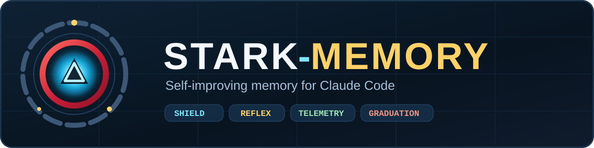
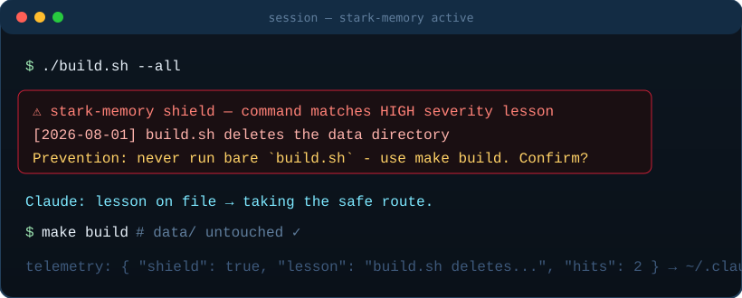
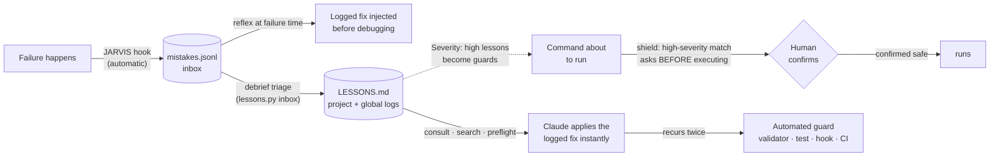

<div align="center">



[](LICENSE)   

</div>

---

## The idea in 10 seconds

Tony Stark never builds the same suit twice. This skill gives every Claude Code session a
memory of past failures — **per project** (`.claude/LESSONS.md`) and **across all projects**
(`~/.claude/LESSONS.md`) — then wires that memory into the loop: a **shield** that questions
destructive commands before they run, a **reflex** that applies the logged fix the instant
a known failure reappears, and JARVIS telemetry that records every failure automatically.
Lessons compound instead of evaporating when the session ends.

<div align="center">

</div>



---

## Install

### Option A — Plugin (recommended: one command, hooks included)

In Claude Code:

```
/plugin marketplace add JrKrishh/stark-memory
/plugin install stark-memory@stark-memory
/reload-plugins
```

That's the whole install: the skill, **both JARVIS hooks (shield + reflex), and telemetry**
wire themselves automatically. Invoke explicitly with `/stark-memory:learn-from-mistakes`.

### Option B — Manual skill copy

**macOS / Linux**

```bash
git clone https://github.com/JrKrishh/stark-memory.git
mkdir -p ~/.claude/skills
cp -r stark-memory/skills/learn-from-mistakes ~/.claude/skills/
```

**Windows PowerShell**

```powershell
git clone https://github.com/JrKrishh/stark-memory.git
New-Item -ItemType Directory -Force "$HOME\.claude\skills" | Out-Null
Copy-Item -Recurse stark-memory\skills\learn-from-mistakes "$HOME\.claude\skills\"
```

> Prefer project-only? Copy into `<project>/.claude/skills/` instead.
> Claude Code picks the skill up automatically in every new session;
> invoke explicitly any time with `/learn-from-mistakes`.

### Step 2 — Manual hooks (skip if you installed via plugin)

Without this step the skill still works, but logging depends on Claude remembering to debrief.
With these two hooks, **failures are recorded as they happen, logged fixes are injected at
the moment of failure, and high-severity lessons demand confirmation before their commands run**.

Merge into `~/.claude/settings.json`:

```json
{
  "hooks": {
    "PreToolUse": [
      {
        "matcher": "Bash|PowerShell",
        "hooks": [
          {
            "type": "command",
            "command": "python",
            "args": ["~/.claude/skills/learn-from-mistakes/scripts/jarvis_inbox.py"],
            "timeout": 10,
            "statusMessage": "stark-memory shield"
          }
        ]
      }
    ],
    "PostToolUseFailure": [
      {
        "matcher": "Bash|PowerShell",
        "hooks": [
          {
            "type": "command",
            "command": "python",
            "args": ["~/.claude/skills/learn-from-mistakes/scripts/jarvis_inbox.py"],
            "timeout": 10,
            "statusMessage": "JARVIS logging failure"
          }
        ]
      }
    ]
  }
}
```

- Replace `~` with an absolute path (`C:/Users/<you>/...` on Windows).
- Keep both hooks synchronous (no `"async"`): they don't just record failures —
  **the reflex** injects a logged fix into context the moment a command fails,
  and **the shield** asks for confirmation before a command matching a
  high-severity lesson even executes.
- Full walkthrough incl. Windows specifics: [`references/jarvis-hook.md`](skills/learn-from-mistakes/references/jarvis-hook.md).

### Step 3 — (Optional) Auto-load lessons at session start

A `SessionStart` hook can inject your lesson logs into context every session:
[`references/session-start-hook.md`](skills/learn-from-mistakes/references/session-start-hook.md).

---

## How to use

Mostly, you don't — the skill runs itself inside sessions:

| Moment | What Claude does |
|---|---|
| Before a high-severity command runs | **The shield** asks for confirmation, quoting the logged lesson |
| Before non-trivial work | Consults both logs; follows any matching **Prevention** rule |
| Before touching unfamiliar files | Runs `preflight` — surfaces lessons scoped to those exact paths |
| A logged error reappears | **The reflex** injects the known fix before debugging starts |
| After fixing something new | Logs it (severity, trigger, root cause, fix, prevention) |
| End of a big task | Debriefs: triages the JARVIS inbox, catches near-misses |

Your part is two commands at a natural stopping point:

```bash
python ~/.claude/skills/learn-from-mistakes/scripts/lessons.py inbox          # what failed lately?
python ~/.claude/skills/learn-from-mistakes/scripts/lessons.py inbox --clear  # after logging the keepers
```

### CLI cheat sheet — `lessons.py`

| Command | What it does |
|---|---|
| `search <keywords>` | Find entries across both logs |
| `preflight [files...]` | Lessons matching files about to change (defaults to `git diff`) |
| `inbox [--all] [--clear]` | Triage JARVIS-captured failures (this project by default) |
| `recall <question>` | Federated query: lesson logs + session RAG + workspace corpora, sources labeled |
| `patterns` | Cluster entries into failure classes — "fix the class, not the instance" |
| `stale` | Flag lessons whose watched paths churned in git since their date |
| `graduate "<title>"` | Scaffold the guard: hook JSON + validator stub + CI step |
| `bootstrap [--apply]` | Mine fix/revert commits into draft lessons |
| `save "<title>"` | Bump a lesson's Saves counter — its ROI ledger |
| `stats` | Categories, hot-spots, graduation candidates, pruning candidates |
| `env` | Print an environment fingerprint for `Env:` lines |

### What a lesson looks like

```markdown
### [2026-08-22] build.sh deletes the data/ directory
- **Severity:** high
- **Paths:** scripts/**
- **Trigger:** building the project
- **What happened:** ./build.sh wiped data/ and the build then failed
- **Root cause:** cleanup line `rm -rf $OUT data` removes data/ — wrong path
- **Fix:** restored data/ from backup; built with `make build` instead
- **Prevention:** never run ./build.sh — always `make build`
```

The **Prevention** line is the payload — it's what future sessions act on.
**Paths:** globs make `preflight` fire before the right files change.

---

## From memory to machine

A lesson that keeps mattering shouldn't stay a note. The automation ladder:

| Level | Meaning | Enforced by |
|---|---|---|
| 0 | Logged | exists in LESSONS.md |
| 1 | Habit | consulted before matching work |
| 2 | Guard | validator / test / fixed at the source |
| 3 | Impossible | PreToolUse hook or CI gate |

Graduate when a lesson **recurs a second time**, or immediately if severity is high.
Recipes: [`references/automation-ladder.md`](skills/learn-from-mistakes/references/automation-ladder.md).

---

## Where everything lives

| File | Scope | Commit it? |
|---|---|---|
| `<project>/.claude/LESSONS.md` | this codebase's quirks | yes — teammates' Claude inherits the scars |
| `~/.claude/LESSONS.md` | portable, cross-project lessons | local only |
| `~/.claude/mistakes.jsonl` | raw JARVIS telemetry | **never** — may contain command output |

Privacy notes: the inbox stays local and self-trims past 400 lines; entries carry no secrets
by policy (`Env:` fingerprints hold versions, not tokens); lessons enter `LESSONS.md` only
through human-reviewed triage.

---

## Layout

```
.claude-plugin/
├── plugin.json                        # plugin manifest (hooks bundled via ${CLAUDE_PLUGIN_ROOT})
└── marketplace.json                   # installable as a Claude Code marketplace
assets/
└── logo.svg                          # the arc-reactor memory core
skills/
└── learn-from-mistakes/
    ├── SKILL.md                      # the skill itself
    ├── scripts/
    │   ├── lessons.py                # search · preflight · inbox · recall · patterns · stale · graduate
    │   └── jarvis_inbox.py           # shield (PreToolUse) + capture & reflex (PostToolUseFailure)
    └── references/
        ├── log-template.md           # initial LESSONS.md structure & categories
        ├── automation-ladder.md      # recipes for turning lessons into guards
        ├── jarvis-hook.md            # hook install walkthrough (manual route)
        └── session-start-hook.md     # auto-load lessons into every session
```

## Requirements

Python 3.8+ (standard library only) · Claude Code · git (for `preflight`/`bootstrap`)

## License

[MIT](LICENSE) © Boopathi Raja
